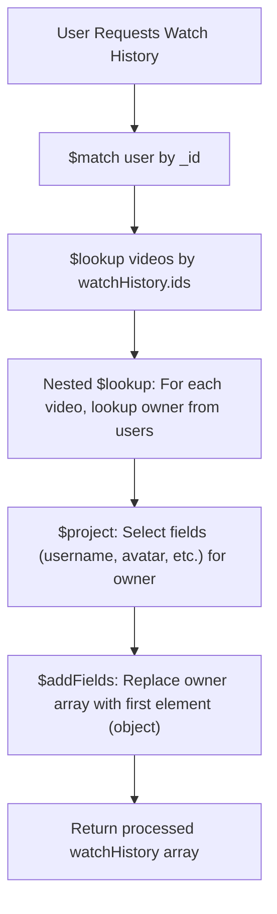

This video transcript describes an advanced approach to building a MongoDB aggregation pipeline and setting up backend routes for a complex "watch history" feature in a user profile system. Below is a detailed summary combining clear structure, main concepts, and an annotated flow chart:

***

## **1. Video Context and Objective**

- **Setting:** Late winter night, responding to strong audience engagement by delivering a final, more complex aggregation pipeline example.
- **Objective:** Build an advanced MongoDB aggregation pipeline to fetch a user's watch history and implement related backend routes. This includes nested ($lookup within $lookup) queries to get detailed information about watched videos and their owners (channels/users).

***

## **2. Watch History Feature: Aggregation Pipeline**

### **A. Problem Statement**
- When a user clicks "history," they should see a list of videos they've watched with thumbnail, title, views, etc.
- The system must join (`$lookup`) watch history IDs with the videos collection and enrich every video with owner (user/channel) info.

### **B. Pipeline Stages**



#### **Step-by-Step Breakdown:**
1. **$match:** Find the user by ID (handle ObjectID conversion – essential for Mongoose/MongoDB compatibility).
2. **$lookup (videos):** For the user's `watchHistory` (an array of video IDs), join with the `videos` collection to fetch full video documents.
3. **Nested $lookup (users):** For each video, join with the `users` collection to get video owner's profile (via video.owner field ⇒ users._id).
4. **$project (owner):** Within the nested pipeline, only select specific owner fields (e.g., username, avatar) to avoid bloated documents.
5. **$addFields:** Since owner lookup creates an array (but owner is just one user), use $first or $arrayElemAt to flatten array into an object.
6. **Return:** Processed watch history array with enriched details, ready for frontend.

#### **Sample Code Structure (for Illustration Only):**
```js
[
  { $match: { _id: new mongoose.Types.ObjectId(user._id) } },
  { $lookup: {
      from: "videos",
      localField: "watchHistory",
      foreignField: "_id",
      as: "watchHistory",
      pipeline: [
        { $lookup: {
            from: "users",
            localField: "owner",
            foreignField: "_id",
            as: "owner",
            pipeline: [
              { $project: { username: 1, avatar: 1 } }
            ]
          }
        },
        { $addFields: { owner: { $first: "$owner" } } }
      ]
    }
  }
]
```
*(Actual code guided by Mongoose/MongoDB syntax and checks for ObjectId conversion)*

***

## **3. Backend Routes Implementation**

The video walks through how to set up Express.js backend routes (controllers and routers) for user profile management:

- **Change Password (POST /change-password):** Middleware: JWT verification, handler: changeCurrentPassword.
- **Get Current User (GET /current-user):** Middleware: JWT verification, handler: getCurrentUser.
- **Update Account Details (PATCH /update-account-details):** Middleware: JWT, handler: updateAccountDetails.
- **Update Avatar/Cover Image (PATCH /avatar, PATCH /cover-image):** Middleware: JWT, file upload (multer), handlers: updateUserAvatar, updateUserCoverImage.
- **Get Channel Profile (GET /channel/:username):** Middleware: JWT, handler: getUserChannelProfile.
- **Get Watch History (GET /history):** Middleware: JWT, handler: getWatchHistory (core function described above).

Routes are written to ensure modularity and use middlewares for authentication and file handling.

***

## **4. Key Advanced Concepts and Interview Tips**

- **ObjectId in Aggregation:** Handling conversion between string and MongoDB ObjectId is critical for matching documents in aggregation, especially with Mongoose.
- **Nested Lookups:** Advanced usage of aggregation pipelines, with $lookup inside another $lookup.
- **Pipeline Optimization:** Use $project within lookups to control payload size.
- **Flat vs. Array Results:** Post-processing ($addFields, $first, $arrayElemAt) to shape data efficiently for frontend.
- **Error Handling:** Carefully validates inputs and checks pipeline results, throws user-friendly errors.

***

## **5. Developer Advice and Real-World Insights**

- Complexity is normal at advanced levels; real projects require non-trivial joins and data transformations.
- Observing senior developers, repeatedly writing and refactoring code, helps understand advanced aggregation use cases.
- Frontend-backend negotiation: How you shape final data affects developer productivity and user experience (e.g., flattening owner info).
- Tutorials help, but hands-on experimentation (moving project/projection stages inside/outside pipeline) is crucial for mastery.

***

### **Summary Table: Key Pipeline Stages**

| Stage                | Purpose                                         | MongoDB Operator      |
|----------------------|-------------------------------------------------|-----------------------|
| User Match           | Find user by _id                                | $match                |
| Watch History Lookup | Join with videos by video IDs                   | $lookup               |
| Owner Nested Lookup  | For each video, fetch owner info from users     | $lookup (nested)      |
| Project Fields       | Limit owner fields for payload efficiency       | $project              |
| Flatten Owner Array  | Convert owner array to object for frontend      | $addFields + $first   |

***

**In essence:**  
This video demonstrates a complex, nested aggregation pipeline to fetch enriched watch history and sets up robust user profile-related routes in a Node.js backend. It closely mimics real-world requirements and interview-readiness, emphasizing hands-on learning and system-level thinking.