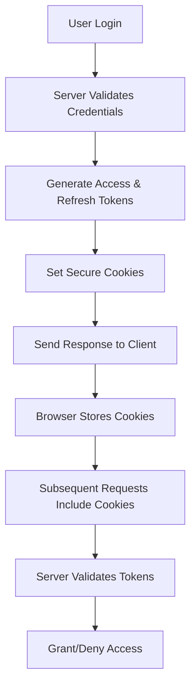

# Cookie-Based Authentication in Express.js

## Understanding the Code

```javascript
res.status(200)
   .cookie("accessToken", accessToken, options)
   .cookie("refreshToken", refreshToken, options)
   .json(new ApiResponse(200, {user, accessToken, refreshToken}, "User logged in successfully"));
```

## What does .cookie(...) do?

The `.cookie()` method tells the server to store the token inside a browser cookie.

When the response goes back to the browser, the browser will save:
- A cookie named "accessToken" with the access token value
- A cookie named "refreshToken" with the refresh token value

## Why Use Cookies?

### Automatic Token Transmission
Cookies automatically get sent by the browser on every request to your server.

Example Flow:
1. User logs in → Server sets cookies
2. User makes request to `/getPosts` → Browser automatically includes:

```
Cookie: accessToken=abc123; refreshToken=xyz789
```

3. Server reads cookies and verifies the user

### Benefits
- No manual work: Don't need to manually attach tokens in headers from frontend
- Seamless authentication: Server can automatically read cookies and verify user
- Persistent storage: Cookies survive browser restarts (if configured)

## Security Considerations

### The Problem
You normally don't want access/refresh tokens sitting in normal cookies because:
- JavaScript can read them → Risk of XSS attacks
- Vulnerable to cross-site scripting

### The Solution: Secure Cookie Options

```javascript
const options = {
  httpOnly: true,    // Can't be accessed by JavaScript
  secure: true,      // Sent only over HTTPS
  sameSite: "strict" // Controls cross-site requests
};
```

#### Security Options Explained:

| Option | Purpose | Description |
|--------|---------|-------------|
| `httpOnly: true` | XSS Protection | Cookie cannot be accessed by JavaScript |
| `secure: true` | HTTPS Only | Cookie sent only over encrypted connections |
| `sameSite: "strict"` | CSRF Protection | Cookie not sent on cross-site requests |

## Simple Summary

What `.cookie()` does:
- Stores tokens in browser as cookies
- Browser automatically sends them with every request
- Makes authentication smoother and seamless

## Cookies vs localStorage Comparison

### Cookies
**Pros:**
- Automatic transmission with every request
- Can be secured with `httpOnly`, `secure`, `sameSite`
- Server can set and manage them
- Works even if JavaScript is disabled

**Cons:**
- Size limit (4KB per cookie)
- Sent with every request (bandwidth overhead)
- Complex CSRF protection needed

### localStorage
**Pros:**
- Larger storage capacity (5-10MB)
- No automatic transmission (no bandwidth overhead)
- Simple to use with JavaScript

**Cons:**
- Vulnerable to XSS attacks
- Manual token attachment required
- Doesn't work if JavaScript is disabled
- Not sent automatically to server

## Best Practices

### For Production Applications:

```javascript
const cookieOptions = {
  httpOnly: true,           // Prevent XSS
  secure: process.env.NODE_ENV === 'production', // HTTPS in production
  sameSite: 'strict',       // Prevent CSRF
  maxAge: 24 * 60 * 60 * 1000 // 24 hours
};

// Set secure cookies
res.cookie("accessToken", accessToken, cookieOptions)
   .cookie("refreshToken", refreshToken, {
     ...cookieOptions,
     maxAge: 7 * 24 * 60 * 60 * 1000 // 7 days for refresh token
   });
```

### Implementation Strategy:
1. Access tokens → Short-lived (15-30 minutes)
2. Refresh tokens → Longer-lived (7-30 days)
3. Always use secure options in production
4. Implement proper CORS for cross-origin requests

## Complete Authentication Flow



This cookie-based approach provides a secure, automatic, and user-friendly authentication system!